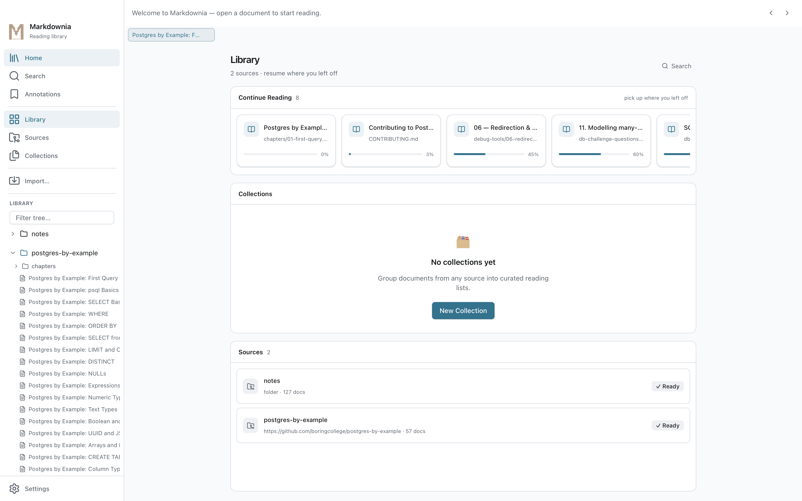
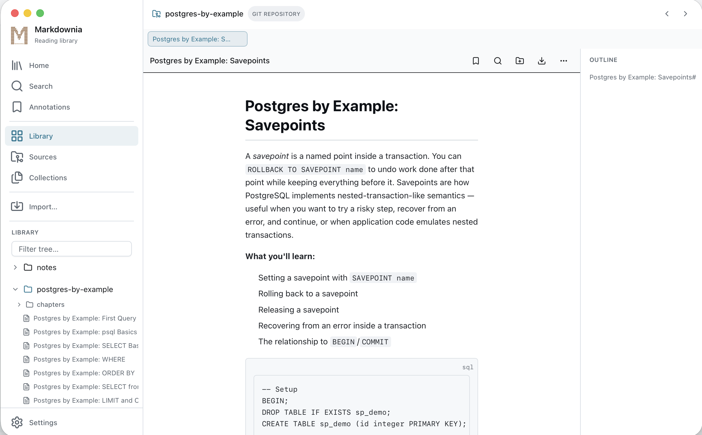
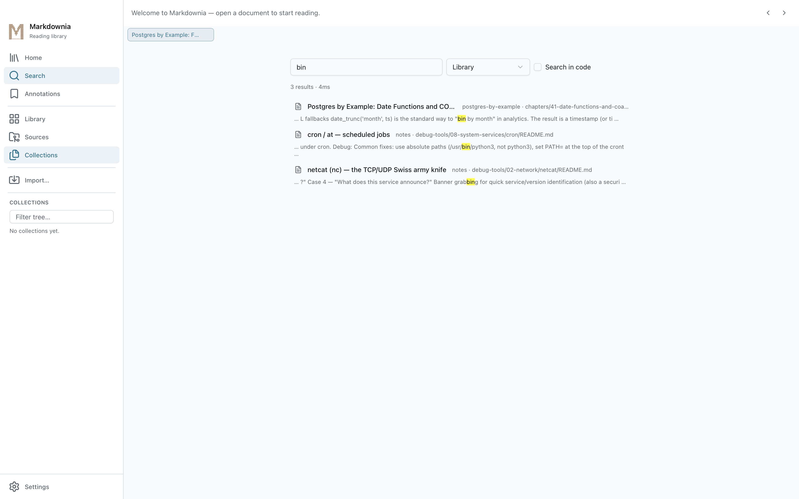
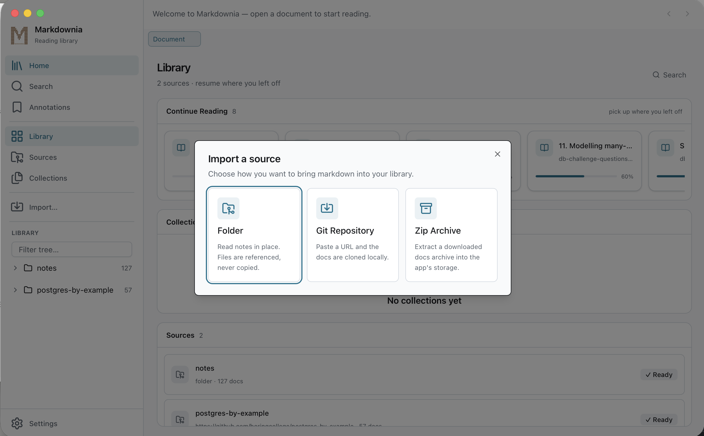
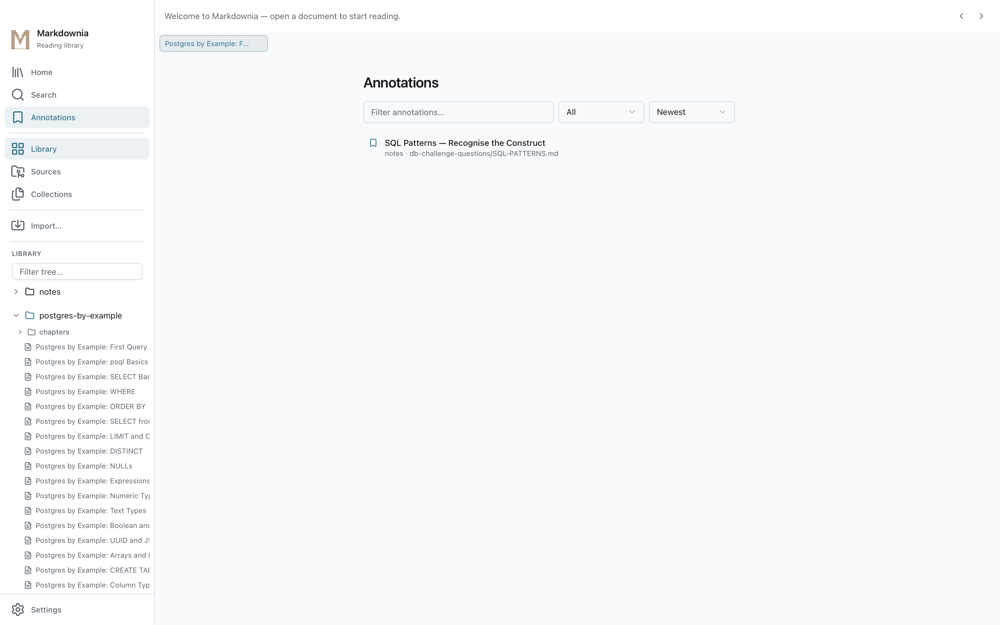
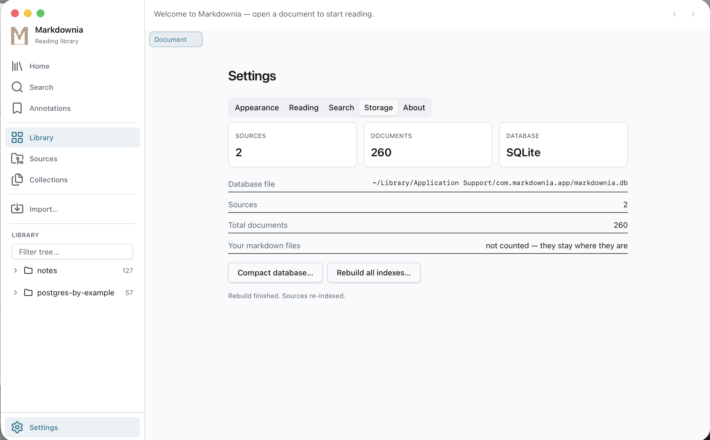

<p align="center">
  
</p>

<h1 align="center">Markdownia</h1>

<p align="center">
  <strong>Turn any pile of markdown into a beautifully rendered reading library.</strong>
</p>

<p align="center">
  Offline-first · Private by design · No accounts · No cloud · No telemetry
</p>

<p align="center">
  
  
  
  
  
</p>

---

## The reading library for your markdown

Markdownia is a **desktop reading app** for people who keep notes, docs, and
knowledge bases as markdown. Import a folder, a git repo, or a zip — and get a
fast, indexed, beautifully rendered library. Everything stays on your machine.

> **Markdownia is a reader, not an editor.** Your files are never copied (except
> zip/git extractions), never reformatted, and never uploaded anywhere.

---

## Screenshots

| Home | Reading a document |
| --- | --- |
|  |  |

| Search | Import |
| --- | --- |
|  |  |

| Annotations | Settings |
| --- | --- |
|  |  |

---

## Features

### 📥 Three ways to import
- **Folder** — read your notes *in place*; files are referenced, never copied. Edit outside, and changes appear on the next scan.
- **Git repository** — paste a URL and the docs are cloned locally. *This is the only step that touches the network.*
- **Zip archive** — a downloaded docs bundle is extracted into app-managed storage so the index stays fresh.

### 📖 A proper reading experience
- **Six reading themes** — Paper, Sepia, Solarized, Nord, Dracula, and Gruvbox, applied instantly to the page.
- **Syntax-highlighted code** blocks and **Mermaid diagrams** rendered on demand.
- **Internal links** between documents resolve inside the app; external links open in your browser.
- **Adjustable font, size, and measure** with a live preview.

### 🔖 Annotations that survive re-indexing
- **Bookmark** any document and toggle it from the toolbar.
- **Highlight passages** anchored to the source block — highlighted text stays pinned to the right lines even after a re-index changes the file.
- Curate everything from the **Annotations** screen with filter and sort.

### 🗂 Collections
- Group documents from **any source** into curated reading lists — membership never moves or copies files.

### ⚡ Fast by design
- Documents are rendered once at **index time** with [goldmark](https://github.com/yuin/goldmark), cached as HTML in SQLite, and served from cache on every open.
- **Full-text search** over every imported document with SQLite **FTS5** — offline, no index server.

### 🧭 Resume exactly where you left off
- Continue Reading shows your recent documents with read progress.
- Scroll position is saved per context; tabs and open documents restore across restarts.

### 🚀 Export
- Export a document (or a whole collection) to **PDF** or a **standalone HTML** file.

---

## Tech stack

| Layer | Technology |
| --- | --- |
| Desktop shell | [Wails 3](https://v3.wails.io) (Go + system webview) |
| Backend | Go, [goldmark](https://github.com/yuin/goldmark), [chroma](https://github.com/alecthomas/chroma), [go-git](https://github.com/go-git/go-git) |
| Storage | SQLite (FTS5 for search) |
| Frontend | [React](https://react.dev) 19, [Vite](https://vitejs.dev), [Tailwind CSS](https://tailwindcss.com) v4, [shadcn/ui](https://ui.shadcn.com), [lucide](https://lucide.dev) icons |
| Rendering | Mermaid, KaTeX, highlight.js-style code blocks |

---

## Getting started

### Prerequisites
- [Go](https://go.dev) **1.26+**
- [Bun](https://bun.sh)
- [Wails 3 CLI](https://v3.wails.io) (pinned: `v3.0.0-beta.7`)

### Build & run

```sh
wails3 task build    # build bin/markdownia with the embedded frontend
wails3 task run      # run the packaged app
```

Or use the Makefile:

```sh
make build       # build the runnable binary
make dev         # dev mode with hot reload
make run         # run the packaged app
```

The frontend lives in `web/` (Vite + React + Tailwind). Its build output is
embedded into the binary by the Wails build — the app has **zero runtime network
dependencies**.

### Test & guard

```sh
make test          # Go unit + integration tests (race detector)
make lint          # golangci-lint (errcheck on)
make security      # gosec + govulncheck
make web-check     # zero-network guarantee on the built frontend bundle
make test-coverage # tests with HTML coverage report
```

### Package for distribution

```sh
make package-macos    # .app (universal) + .dmg
make package-windows  # NSIS installer + portable exe
make package-linux    # .deb + .AppImage
make release-ci       # full release across all OSes
```

---

## Where your data lives

| Platform | Path |
| --- | --- |
| **macOS** | `~/Library/Application Support/com.markdownia.app/` |
| **Windows** | `%APPDATA%\com.markdownia.app\` |
| **Linux** | `$XDG_DATA_HOME/com.markdownia.app/` (fallback `~/.local/share`) |

Uninstalling the app does **not** delete your library database or your markdown
files. Your source folders stay exactly where they are.

---

## Design principles

- **Offline-first.** Rendering, indexing, and search all happen locally. The only
  outbound network calls are `git clone`/`pull` and a manual
  *Help → Check for Updates*.
- **Private by default.** No accounts, no sync, no telemetry, no background
  processes. One SQLite file on your machine is the whole library.
- **Your files are the source of truth.** Folders are referenced in place. The
  database is a cache you can rebuild at any time.

---

## License

[MIT](LICENSE) © 2026 ANOFAC Systems / Fakih Arief Noto

---

<p align="center">
  Made with <span style="color:#e25555">❤</span> for <strong>ANOFAC Systems</strong>
</p>
